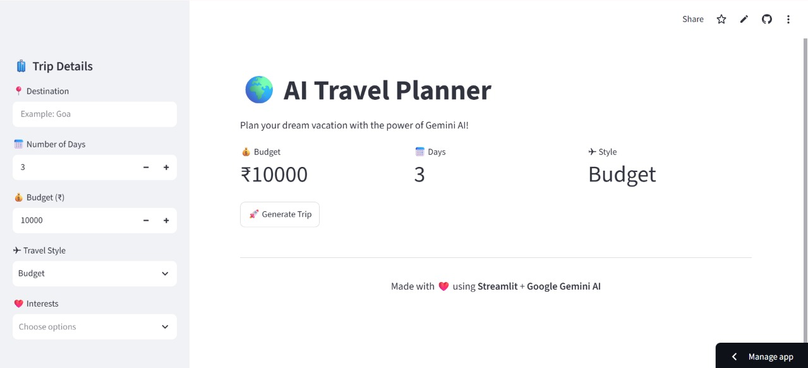
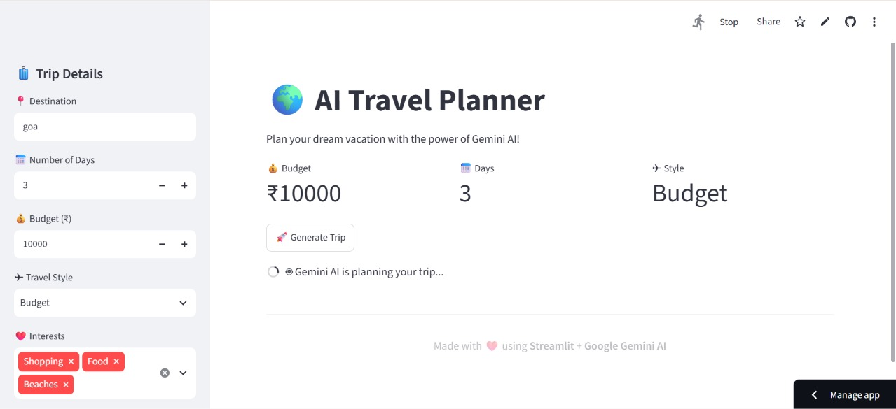
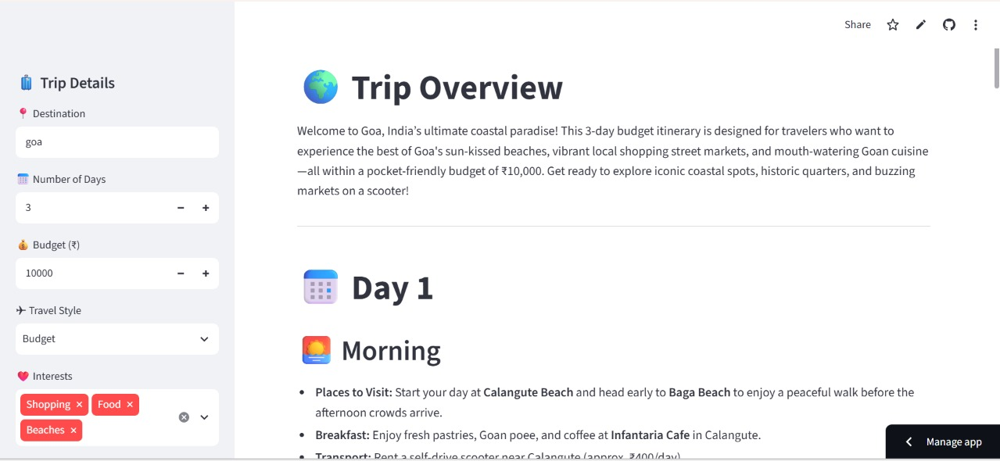
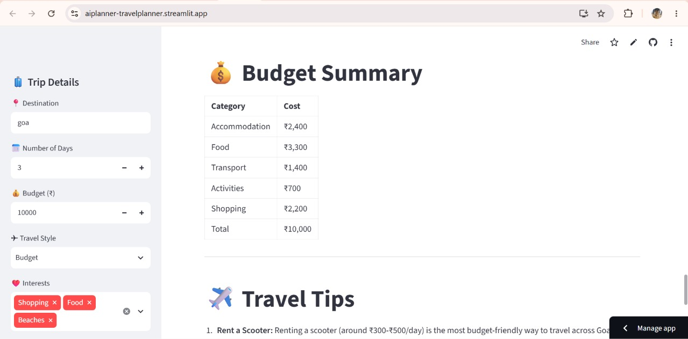

# 🌍 AI Travel Planner

An AI-powered travel planner that generates personalized travel itineraries based on your destination, budget, travel style, trip duration, and interests using **Google Gemini AI** and **Streamlit**.

---

## 📌 Features

- 🌍 Generate personalized travel itineraries
- 📅 Day-wise travel planning
- 💰 Budget estimation
- 🍽️ Local food recommendations
- 🛍️ Shopping recommendations
- 🚕 Local transportation suggestions
- ✈️ Travel tips
- 📄 Download itinerary as a text file
- 🤖 Powered by Google Gemini AI
- 🎨 Interactive Streamlit interface

---

## 🛠️ Technologies Used

- Python
- Streamlit
- Google Gemini API
- python-dotenv
- Markdown
- VS Code

---

## 📂 Project Structure

```
AI_Travel_Planner/
│
├── app.py
├── prompt.py
├── .env
├── requirements.txt
├── README.md
└── venv/
```

---

## 🚀 Installation

### 1. Clone the Repository

```bash
git clone https://github.com/yourusername/AI_Travel_Planner.git
```

Move to the project folder.

```bash
cd AI_Travel_Planner
```

---

### 2. Create a Virtual Environment

```bash
python -m venv venv
```

Activate it.

#### Windows

```bash
venv\Scripts\activate
```

#### macOS/Linux

```bash
source venv/bin/activate
```

---

### 3. Install Dependencies

```bash
pip install -r requirements.txt
```

---

### 4. Create a `.env` File

Create a file named `.env` in the project folder.

Add your Gemini API key.

```text
GEMINI_API_KEY=YOUR_API_KEY
```

---

### 5. Run the Application

```bash
streamlit run app.py
```

The application will open automatically in your browser.

---

## 💻 How It Works

1. Enter your destination.
2. Select the number of travel days.
3. Enter your budget.
4. Choose your travel style.
5. Select your interests.
6. Click **Generate Trip**.
7. Gemini AI generates a personalized itinerary.
8. Download the itinerary as a text file.

---

## 📷 Sample Output

The application generates:

- 🌍 Trip Overview
- 📅 Day-wise itinerary
- 🍽️ Food recommendations
- 🛍️ Shopping guide
- 💰 Budget summary
- 🚕 Local transportation
- ✈️ Travel tips

---
## 📸 Screenshots

### 🏠 Home Page



---

### 📝 User Input



---

### 🌍 Generated Travel result



---
### 🌍 Generated Travel budget summary



---


### 📄 Download Travel Plan


## 🔮 Future Enhancements

- 🌤️ Live Weather Information
- 🗺️ Google Maps Integration
- 🏨 Hotel Recommendations
- ✈️ Flight Price Suggestions
- 📄 PDF Download
- ❤️ Save Trip History
- 🌐 Multi-language Support
- 🎙️ Voice Input
- 📱 Mobile Responsive UI

---

## 📦 Requirements

```
streamlit
google-genai
python-dotenv
```

Install using

```bash
pip install -r requirements.txt
```

---

## 👩‍💻 Author

**Iswarya Jasmine**

B.Tech – Artificial Intelligence & Machine Learning

---

## ⭐ If you like this project

Give this repository a ⭐ on GitHub.

---

## 📄 License

This project is developed for learning and educational purposes.
